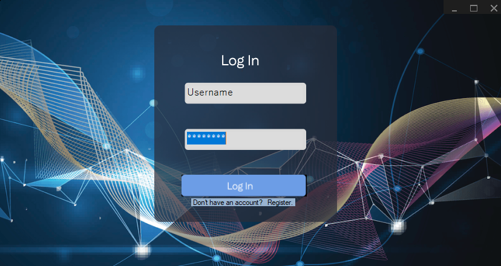
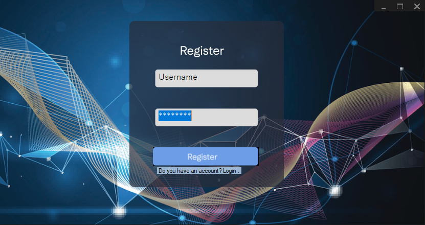
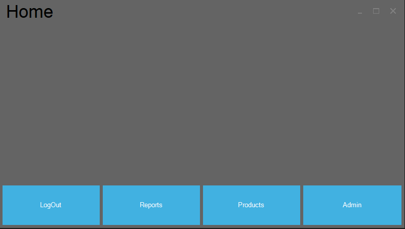
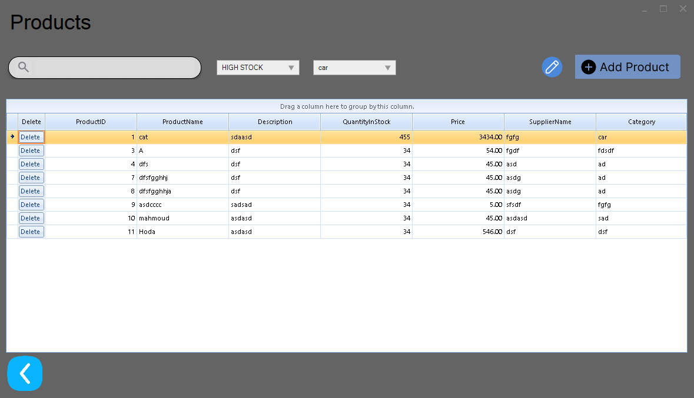
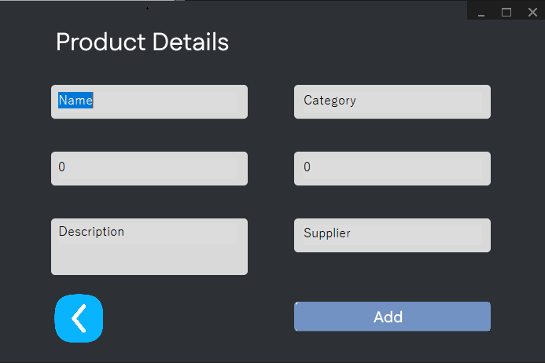
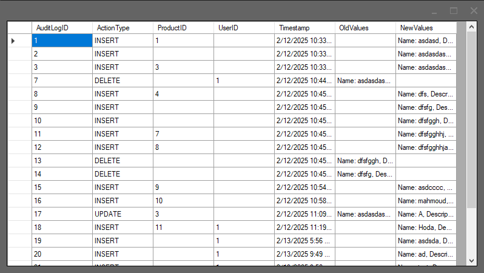
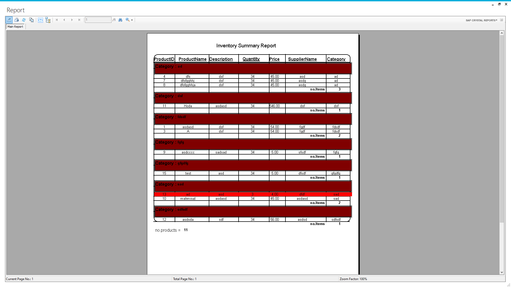

## Small brief about all files
-
    ```
    .
    │   SQLQuery.sql                   # Database schema (tables, triggers)
    │
    ├───Inventory Management System    # Main project folder
    │   │   App.config                 
    │   │   CrystalReport.rpt          # Crystal Report template file
    │   │   Program.cs                 # Main entry point of the application
    │   │
    │   ├───Helpers                     # Utility classes and enums
    │   │       RelayCommand.cs         # Implementation of ICommand for MVVM pattern
    │   │       StockEnum.cs            # Enum for stock-related values
    │   │       Utilities.cs            # Common helper methods used in the project
    │   │
    │   ├───Models                      # Data models representing database entities
    │   │       Product.cs              # Model for Product entity
    │   │       User.cs                 # Model for User entity
    │   │
    │   ├───Resources                   # (images, icons)
    │   │
    │   ├───Services                    
    │   │       AuthServices.cs         # Authentication used
    │   │       DatabaseService.cs      # database operations
    │   │
    │   ├───ViewModel                   # ViewModels for MVVM pattern
    │   │       AddProductViewModel.cs  # ViewModel for adding products
    │   │       EditProductModelView.cs # ViewModel for editing products
    │   │       LoginViewModel.cs       # ViewModel for login screen
    │   │       ProductViewModel.cs     # ViewModel for viewing,adding,editing products using dataGridView
    │   │       RadGridViewModel.cs     # ViewModel for viewing data
    │   │       RegisterViewModel.cs    # ViewModel for user registration
    │   │       ReportViewModel.cs      # ViewModel for CrystalReports
    │   │
    │   └───Views                       # UI views for different features
    │       ├───AddProduct              # Views for adding products
    │       ├───Admin                   # Admin dashboard
    │       ├───EditProduct             # Views for editing products
    │       ├───Home                    # Home screen 
    │       ├───LogIn                   # User login 
    │       ├───Products                # Views for managing product listings
    │       ├───RadGrid                 # Views for managing product listings using RadGrid
    │       ├───Register                # User registration 
    │       └───Report                  # Report generation 

    
## Screens from running application
* Login 
    
* Register
    
* Home 
    
* Products using RadGrid
    
* Adding Product 
    
* Admin dashboard
    
* Report
    
